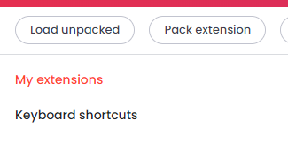

# LegendLifeEnhancer Development Plugin Installation Guide

## Enabling Development Mode in Google Chrome

To install the LegendLifeEnhancer plugin, you need to first enable Development Mode in Google Chrome. Here's how:

1. Open Google Chrome.
2. Navigate to `chrome://extensions/` by typing it into the address bar.
3. Enable "Developer mode" by toggling the switch in the top-right corner.

(Example for Brave)

## Loading the Packed Plugin

Once Development Mode is enabled, you can load the packed plugin file:

1. Click the "Load unpacked" button that appears after enabling Developer Mode.
2. Navigate to the directory where your `LegendLifeEnhancer` plugin is located.
3. Select the plugin's folder (which should contain the `manifest.json` file) and click "Open".

(Example for Brave)

The `LegendLifeEnhancer` plugin should now be installed and visible in the list of extensions.

## Notes

- Make sure the plugin's folder contains all the necessary files, including `manifest.json`.
- If you make changes to the plugin, you may need to refresh the extension from the `chrome://extensions/` page to apply them.
- Keep the Development Mode enabled while you are developing and testing the plugin.

Happy Coding!
